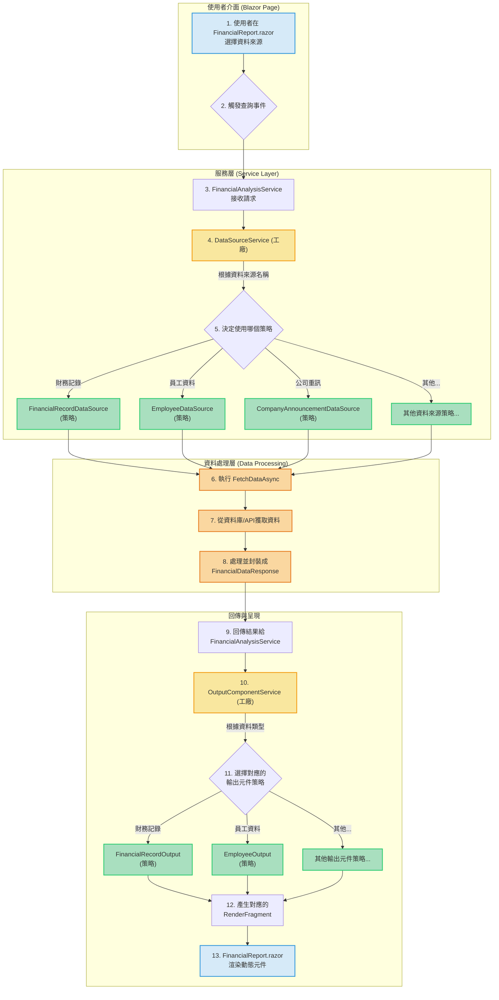

# Blazor 金融資訊查詢系統

本專案是一個使用 Blazor Server 技術開發的金融資訊查詢與分析的練習專案，以下內容均為本人經AI調整後產出。

專案的核心特色是深度整合了「工廠模式 (Factory Pattern)」與「策略模式 (Strategy Pattern)」，使得系統在新增資料來源或調整輸出格式時，能最大限度地降低對現有程式碼的修改，符合軟體工程的「開放封閉原則」。

## 核心設計模式
https://github.com/FelixChen1224/blazor-strategy-and-factory/blob/main/README.md
這個專案的架構旨在建立一個**可擴展**且**易於維護**的系統。主要透過兩種設計模式實現：

1.  **工廠模式 (Factory Pattern)**：負責**建立物件**。當您需要根據不同的條件（例如：使用者選擇的資料來源或報表類型）產生不同的物件時，工廠模式就非常有用。它將物件的建立邏輯封裝起來，讓您的主程式碼不用跟複雜的建立過程打交道。在本專案中，`DataSourceService` 和 `OutputComponentService` 扮演工廠的角色。

2.  **策略模式 (Strategy Pattern)**：負責**定義演算法家族**。當您有多種方式可以執行某個特定任務時（例如：從不同資料表或 API 獲取資料），策略模式允許您將這些方式（演算法）封裝成獨立的「策略」類別。您的主程式可以在執行期間根據需求切換使用不同的策略。在本專案中，所有實作 `IDataSourceStrategy` 和 `IOutputComponentStrategy` 的類別都是具體的策略。

---

## 專案運作流程圖

這張圖展示了從使用者發出請求到最終呈現資料的完整流程，並標示了工廠模式與策略模式在哪個環節運作。

### 流程說明

1.  **使用者請求 (步驟 1-2)**：使用者在 Blazor 頁面（`FinancialReport.razor`）上選擇一個資料來源（例如「財務記錄」）並點擊查詢。

2.  **服務層接收 (步驟 3)**：`FinancialAnalysisService` 服務接收到這個請求。

3.  **工廠模式運作 (步驟 4)**：`FinancialAnalysisService` 不會自己決定如何獲取資料，而是將任務交給 `DataSourceService`。這個 Service 扮演**工廠**的角色。

4.  **策略模式運作 (步驟 5)**：`DataSourceService` (工廠) 內部會根據使用者選擇的資料來源名稱（"財務記錄"），從所有已註冊的 `IDataSourceStrategy` 策略中，找到能夠處理這個請求的具體策略。
    *   如果使用者選的是「財務記錄」，工廠會建立一個 `FinancialRecordDataSource` 物件。
    *   如果選的是「員工資料」，則建立 `EmployeeDataSource` 物件。

5.  **執行策略 (步驟 6-9)**：工廠回傳選好的策略物件，接著 `FinancialAnalysisService` 呼叫該策略的 `FetchDataAsync` 方法。這個方法執行特定的資料庫查詢、處理資料，並將結果打包成 `FinancialDataResponse` 回傳。

6.  **輸出工廠與策略 (步驟 10-12)**：收到資料後，`FinancialAnalysisService` 再次使用**工廠模式** (`OutputComponentService`)，根據回傳的資料類型，選擇一個最適合的**輸出策略**（例如 `FinancialRecordOutput`），這個策略知道如何將財務記錄資料轉化為 Blazor 可以渲染的 UI 元件。

7.  **渲染結果 (步驟 13)**：最終，`FinancialReport.razor` 頁面接收到這個 UI 元件並將其動態地顯示給使用者。

## 架構優點

*   **高內聚，低耦合**：每個資料來源的處理邏輯都封裝在自己的策略類別中，與主流程分離。
*   **易於擴展**：當需要支援新的資料來源時，只需要建立一個新的策略類別並在 `Program.cs` 中註冊即可，無需修改現有程式碼。
*   **易於維護與測試**：可以獨立測試每一個策略，確保其資料查詢邏輯的正確性，而不會影響到系統的其他部分。
